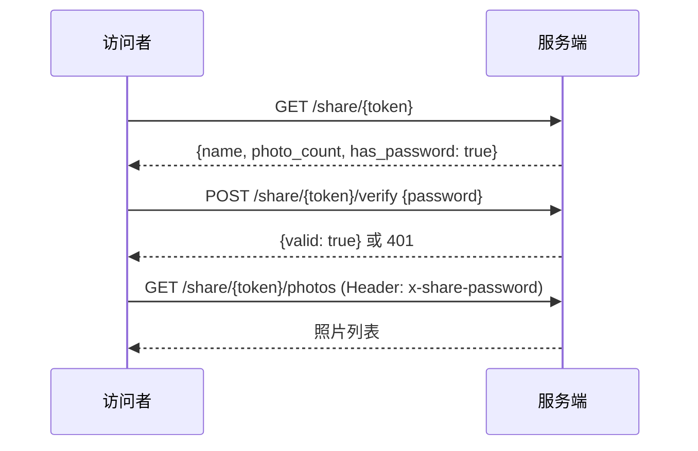

# FastPhoto 功能文档

> 本文档涵盖 FastPhoto 所有已实现功能，包括 API 端点、前端页面和测试指引。

---

## 目录

1. [基础架构](#1-基础架构)
2. [用户认证](#2-用户认证)
3. [图库管理](#3-图库管理)
4. [照片浏览](#4-照片浏览)
5. [搜索](#5-搜索)
6. [AI 功能](#6-ai-功能)
7. [相册](#7-相册)
8. [人脸识别](#8-人脸识别)
9. [收藏/星标](#9-收藏星标)
10. [回收站](#10-回收站)
11. [批量操作](#11-批量操作)
12. [照片上传](#12-照片上传)
13. [重复检测](#13-重复检测)
14. [标签系统](#14-标签系统)
15. [分享链接密码](#15-分享链接密码)
16. [主题切换](#16-主题切换)
17. [活动日志](#17-活动日志)
18. [存储配置](#18-存储配置)

---

## 1. 基础架构

### 技术栈

| 层 | 技术 |
|----|------|
| 后端 | Rust (Axum + SQLx + SQLite) |
| 前端 | React + TypeScript + Vite |
| AI | Python (CLIP/ONNX) via HTTP |
| 容器化 | Docker 多阶段构建 |

### 项目结构

```
crates/
  core/       # 数据库、模型、业务逻辑
  server/     # HTTP API (Axum)
  common/     # 共享类型
  ai/         # AI 服务客户端
web/          # React 前端
```

### 启动方式

```bash
# 开发模式
cargo run                              # 后端 (默认 :3000)
cd web && npm run dev                  # 前端 (默认 :5173)

# Docker
docker compose up --build
```

---

## 2. 用户认证

### API

| 端点 | 方法 | 说明 | 认证 |
|------|------|------|------|
| `/api/auth/register` | POST | 注册 | ❌ |
| `/api/auth/login` | POST | 登录，返回 JWT | ❌ |
| `/api/auth/me` | GET | 获取当前用户信息 | ✅ |

### 请求示例

```bash
# 注册
curl -X POST http://localhost:3000/api/auth/register \
  -H 'Content-Type: application/json' \
  -d '{"username": "admin", "password": "123456"}'

# 登录
curl -X POST http://localhost:3000/api/auth/login \
  -H 'Content-Type: application/json' \
  -d '{"username": "admin", "password": "123456"}'
# 返回: {"token": "eyJ...", "user": {...}}
```

### 前端测试

1. 打开首页，应自动弹出登录对话框
2. 输入用户名和密码，点击登录
3. 登录成功后进入主界面
4. 刷新页面应保持登录状态（JWT 存储在 localStorage）
5. 点击侧边栏底部用户头像可退出登录

---

## 3. 图库管理

### API

| 端点 | 方法 | 说明 |
|------|------|------|
| `/api/libraries` | GET | 列出所有图库 |
| `/api/libraries` | POST | 创建图库 `{name, path}` |
| `/api/libraries/{id}` | DELETE | 删除图库 |
| `/api/libraries/{id}/scan` | POST | 触发扫描 |
| `/api/libraries/scan-progress` | GET | 查询扫描进度 |

### 前端测试

1. 进入 **设置 → 图库管理**
2. 点击「添加图库」，输入名称和服务器上的照片文件夹路径
3. 创建后点击刷新按钮触发扫描
4. 观察扫描进度条实时更新
5. 扫描完成后返回时间线，应能看到照片

---

## 4. 照片浏览

### API

| 端点 | 方法 | 说明 |
|------|------|------|
| `/api/photos/timeline` | GET | 时间线（分页） `?page=1&per_page=50` |
| `/api/photos/folders` | GET | 文件夹列表 |
| `/api/photos/folders/contents` | GET | 文件夹内容 `?path=...` |
| `/api/photos/{id}` | GET | 照片详情（含 EXIF） |
| `/api/photos/{id}/thumbnail/{size}` | GET | 缩略图 `size: small/medium/large` |
| `/api/photos/{id}/original` | GET | 原始文件 |
| `/api/photos/{id}/live-video` | GET | Live Photo 视频 |

### 前端页面

| 页面 | 路由 | 功能 |
|------|------|------|
| 时间线 | `/` | 照片网格 + 无限滚动 + 多选 + 上传 |
| 文件夹 | `/folders` | 按目录浏览 |
| 地图 | `/map` | GPS 坐标显示在 Leaflet 地图上 |

### 前端测试

1. **时间线**：滚动到底部应自动加载更多照片
2. **PhotoViewer**：点击任一照片，查看大图 + 右侧 EXIF 面板
   - 应显示：文件大小、尺寸、类型、相机信息、拍摄时间、GPS 坐标
   - Live Photo：长按图片或按住 L 键播放视频
   - 按 `i` 键可切换信息面板显示/隐藏
   - 按 `Esc` 关闭
3. **文件夹**：按目录结构浏览照片
4. **地图**：有 GPS 信息的照片显示为地图标记

---

## 5. 搜索

### API

| 端点 | 方法 | 说明 |
|------|------|------|
| `/api/photos/search` | GET | CLIP 语义搜索 `?q=日落海滩` |

### 前端测试

1. 进入 **搜索** 页面
2. 输入自然语言描述（如「蓝天白云」「人在海边」）
3. 应返回语义相关的照片结果

---

## 6. AI 功能

### API

| 端点 | 方法 | 说明 |
|------|------|------|
| `/api/ai/classify/{id}` | POST | 对单张照片进行场景分类 |
| `/api/ai/classify-all` | POST | 批量分类所有照片 |
| `/api/ai/embed/{id}` | POST | 生成 CLIP 嵌入向量 |
| `/api/ai/embed-all` | POST | 批量生成嵌入向量 |

### 前端测试

1. 进入 **发现** 页面，查看 AI 场景分类结果
2. 支持 25 个场景类别（风景、人物、美食、建筑等）

---

## 7. 相册

### API

| 端点 | 方法 | 说明 |
|------|------|------|
| `/api/albums` | GET | 列出相册 |
| `/api/albums` | POST | 创建相册 `{name}` |
| `/api/albums/{id}` | GET | 相册详情 |
| `/api/albums/{id}` | DELETE | 删除相册 |
| `/api/albums/{id}/photos` | GET | 相册照片 |
| `/api/albums/{id}/photos` | POST | 添加照片 `{photo_ids: [1,2,3]}` |
| `/api/albums/{id}/photos/{photo_id}` | DELETE | 移除照片 |
| `/api/share/{token}` | GET | 公开分享页（无需认证） |
| `/api/share/{token}/photos` | GET | 公开相册照片 |

### 前端测试

1. 进入 **相册** 页面
2. 点击创建新相册
3. 在相册详情中添加照片
4. 使用分享功能生成公开链接

---

## 8. 人脸识别

### API

| 端点 | 方法 | 说明 |
|------|------|------|
| `/api/faces/scan` | POST | 扫描所有照片的人脸 |
| `/api/faces/cluster` | POST | 聚类人脸 |
| `/api/persons` | GET | 列出所有人物 |
| `/api/persons/{id}` | PUT | 重命名人物 `{name}` |
| `/api/persons/{id}/photos` | GET | 某人的所有照片 |
| `/api/faces/{id}/thumbnail` | GET | 人脸缩略图 |

### 前端测试

1. 进入 **人物** 页面
2. 如果首次使用，点击扫描人脸按钮
3. 扫描完成后点击聚类
4. 应显示识别到的人物分组
5. 点击人物可查看该人所有照片
6. 可以给人物命名

---

## 9. 收藏/星标

### API

| 端点 | 方法 | 说明 |
|------|------|------|
| `/api/photos/{id}/favorite` | POST | 切换收藏状态 |
| `/api/photos/favorites` | GET | 收藏列表 `?page=1&per_page=50` |
| `/api/photos/batch/favorite` | POST | 批量收藏 `{photo_ids, favorite}` |

### DB 字段

`photos.is_favorite` (BOOLEAN, 默认 false)

### 前端测试

1. 在时间线多选照片，点击批量操作栏的「收藏」按钮
2. 进入 **收藏** 页面（侧边栏），应能看到已收藏的照片
3. 在收藏页面点击照片上的取消收藏按钮
4. 刷新后确认状态正确

---

## 10. 回收站

### API

| 端点 | 方法 | 说明 |
|------|------|------|
| `/api/photos/{id}/trash` | POST | 移入回收站 |
| `/api/photos/{id}/restore` | POST | 还原 |
| `/api/photos/{id}/permanent` | DELETE | 永久删除 |
| `/api/photos/trash` | GET | 回收站列表 |
| `/api/photos/trash/empty` | POST | 清空回收站 |
| `/api/photos/batch/trash` | POST | 批量移入 `{photo_ids}` |
| `/api/photos/batch/restore` | POST | 批量还原 `{photo_ids}` |

### DB 字段

`photos.deleted_at` (DATETIME, nullable) — 软删除时间戳

### 行为说明

- 删除照片不会从磁盘移除文件，只是标记 `deleted_at` 时间戳
- 所有用户查询（时间线、文件夹、搜索、地图）自动过滤已删除照片 (`AND deleted_at IS NULL`)
- 永久删除才会从数据库中真正移除记录

### 前端测试

1. 在时间线多选照片，点击「删除」
2. 确认照片从时间线消失
3. 进入 **回收站** 页面（侧边栏 → 管理）
4. 应能看到被删除的照片及删除时间
5. 多选照片，测试「还原」功能 — 还原后应回到时间线
6. 测试「永久删除」— 删除后不可恢复
7. 测试「清空回收站」

---

## 11. 批量操作

### 前端交互

在 **时间线** 页面：
1. 鼠标悬停照片时，左上角出现 checkbox
2. 点击 checkbox 选中照片（不会打开 PhotoViewer）
3. 选中后底部弹出浮动操作栏，显示：
   - `已选 N 项`
   - ❤️ 收藏 — 批量收藏选中照片
   - 🗑 删除 — 批量移入回收站
   - ✕ 取消 — 清除选择

### 前端测试

1. 悬停照片 → 出现 checkbox
2. 勾选多张照片 → 底部弹出操作栏
3. 点击「收藏」→ 批量收藏成功
4. 点击「删除」→ 照片从时间线消失，进入回收站
5. 点击「取消」→ 清除所有选择，操作栏消失

---

## 12. 照片上传

### API

| 端点 | 方法 | 说明 |
|------|------|------|
| `/api/photos/upload` | POST | Multipart 文件上传 |

### 上传流程

1. 客户端通过 `FormData` 发送多文件
2. 服务端接收后：计算 SHA256 哈希 → 保存文件到第一个图库 → 创建数据库记录

### 前端测试

1. 在时间线页面，点击右上角「上传」按钮
2. 选择一张或多张照片文件
3. 上传过程中按钮显示加载状态
4. 上传完成后照片应出现在时间线中

---

## 13. 重复检测

### API

| 端点 | 方法 | 说明 |
|------|------|------|
| `/api/photos/duplicates` | GET | 返回重复照片分组 |

### DB 字段

`photos.phash` (TEXT, nullable) — 感知哈希，用于识别视觉相似照片

### 前端测试

1. 进入 **重复** 页面（侧边栏）
2. 如果有重复照片，显示按组分列
3. 每组显示原始照片和副本
4. 可删除副本照片

---

## 14. 标签系统

### API

| 端点 | 方法 | 说明 |
|------|------|------|
| `/api/tags` | GET | 列出所有标签 |
| `/api/tags/photos` | GET | 按标签搜索照片 `?tag=风景&page=1` |
| `/api/photos/{id}/tags` | GET | 获取照片的标签 |
| `/api/photos/{id}/tags` | POST | 添加标签 `{name, category}` |
| `/api/photos/{id}/tags/{tag_id}` | DELETE | 移除标签 |

### DB 表

- `tags` (id, name, category) — 标签定义
- `photo_tags` (photo_id, tag_id, confidence) — 照片-标签关联

### 标签类别

| category | 说明 |
|----------|------|
| `manual` | 用户手动添加（默认） |
| `scene` | AI 场景分类自动添加 |

### 前端测试

1. 在时间线点击任一照片打开 PhotoViewer
2. 右侧面板滚动到底部，找到「标签」section
3. 初始显示「暂无标签」
4. 在输入框中输入标签名称（如「旅行」），按 Enter 或点击 + 按钮
5. 标签应以彩色胶囊样式出现
6. 点击标签上的 × 按钮可移除标签
7. 关闭 PhotoViewer 再重新打开同一照片，标签应持久保存

### API 测试

```bash
TOKEN="your_jwt_token"

# 添加标签
curl -X POST http://localhost:3000/api/photos/1/tags \
  -H "Authorization: Bearer $TOKEN" \
  -H 'Content-Type: application/json' \
  -d '{"name": "旅行"}'

# 查看照片标签
curl http://localhost:3000/api/photos/1/tags \
  -H "Authorization: Bearer $TOKEN"

# 按标签搜索
curl "http://localhost:3000/api/tags/photos?tag=旅行" \
  -H "Authorization: Bearer $TOKEN"

# 列出所有标签
curl http://localhost:3000/api/tags \
  -H "Authorization: Bearer $TOKEN"
```

---

## 15. 分享链接密码

### API

| 端点 | 方法 | 认证 | 说明 |
|------|------|------|------|
| `/api/albums/{id}/share-password` | POST | ✅ | 设置/清除密码 `{password}` |
| `/api/share/{token}/verify` | POST | ❌ | 验证密码 `{password}` |
| `/api/share/{token}` | GET | ❌ | 获取分享信息（含 `has_password`） |
| `/api/share/{token}/photos` | GET | ❌ | 获取照片（需 `x-share-password` Header） |

### DB 字段

`albums.share_password` (TEXT, nullable)

### 访问流程



### API 测试

```bash
TOKEN="your_jwt_token"

# 设置密码
curl -X POST http://localhost:3000/api/albums/1/share-password \
  -H "Authorization: Bearer $TOKEN" \
  -H 'Content-Type: application/json' \
  -d '{"password": "secret123"}'

# 清除密码
curl -X POST http://localhost:3000/api/albums/1/share-password \
  -H "Authorization: Bearer $TOKEN" \
  -H 'Content-Type: application/json' \
  -d '{"password": null}'

# 验证密码（公开访问）
curl -X POST http://localhost:3000/api/share/SHARE_TOKEN/verify \
  -H 'Content-Type: application/json' \
  -d '{"password": "secret123"}'

# 获取带密码保护的照片
curl http://localhost:3000/api/share/SHARE_TOKEN/photos \
  -H 'x-share-password: secret123'
```

---

## 16. 主题切换

### 实现方式

- CSS 变量覆盖：`[data-theme="light"]` 定义完整的亮色主题变量
- 状态管理：`localStorage.getItem('theme')` 持久化
- 切换逻辑：`document.documentElement.setAttribute('data-theme', theme)`

### 前端测试

1. 侧边栏底部（用户头像上方）有一个圆形按钮
2. 暗色模式下显示 ☀️ 图标，点击切换到亮色
3. 亮色模式下显示 🌙 图标，点击切换到暗色
4. 刷新页面后主题应保持（localStorage）
5. 检查各页面在亮色模式下的显示效果

### 配色对比

| 变量 | 暗色 | 亮色 |
|------|------|------|
| `--bg-primary` | `#0f0f13` | `#f5f5f7` |
| `--bg-secondary` | `#18181f` | `#ffffff` |
| `--text-primary` | `#f0f0f5` | `#1a1a2e` |
| `--accent` | `#6366f1` | `#6366f1` |

---

## 17. 活动日志

### API

| 端点 | 方法 | 说明 |
|------|------|------|
| `/api/activity` | GET | 获取最近 100 条活动记录 |

### DB 表

```sql
activity_logs (
    id          INTEGER PRIMARY KEY,
    user_id     INTEGER REFERENCES users(id),
    action      TEXT NOT NULL,      -- 操作类型
    detail      TEXT,               -- 操作详情
    created_at  DATETIME DEFAULT CURRENT_TIMESTAMP
)
```

### 自动记录的操作

| action | 触发时机 |
|--------|----------|
| `add_tag` | 给照片添加标签 |
| `remove_tag` | 移除照片标签 |

> 注意：目前仅标签操作自动记录活动日志。如需扩展其他操作（上传、删除、收藏等），需在对应 API handler 中调用 `db::log_activity()`。

### 前端测试

1. 先执行一些标签操作（添加/删除标签）
2. 进入 **设置 → 活动日志** tab
3. 应显示操作列表，每条包含操作类型、详情和时间
4. 时间显示为相对格式（「刚刚」「5 分钟前」「2 小时前」）

---

## 18. 存储配置

### 前端页面

设置 → 存储配置 tab，包含三种存储选项：

#### 本地存储（默认）
- 显示为「当前使用」状态
- 使用服务器本地文件系统

#### S3 兼容存储
配置字段：
| 字段 | 说明 | 示例 |
|------|------|------|
| Endpoint | S3 服务地址 | `https://s3.amazonaws.com` |
| Region | 区域 | `us-east-1` |
| Bucket | 存储桶名称 | `my-photos` |
| Access Key | 访问密钥 | `AKIAIOSFODNN7` |
| Secret Key | 秘密密钥 | `wJalrXUtnFEMI/...` |

#### WebDAV
配置字段：
| 字段 | 说明 | 示例 |
|------|------|------|
| WebDAV URL | 服务地址 | `https://example.com/webdav` |
| 用户名 | 认证用户名 | `admin` |
| 密码 | 认证密码 | `password` |
| 基础路径 | 照片存储路径 | `/photos` |

### 前端测试

1. 进入 **设置 → 存储配置**
2. 本地存储卡片应标记为「当前使用」
3. S3 和 WebDAV 卡片应展示配置表单
4. 每个表单有「测试连接」和「保存」按钮

> 注意：存储配置表单目前为展示层 UI，保存和测试连接的后端逻辑需要与 `crates/core/src/storage/` 模块集成。

---

## 附录：侧边栏导航结构

```
浏览
├── 📷 照片      /
├── 📁 文件夹    /folders
├── ✨ 发现      /explore
├── ❤️ 收藏      /favorites
├── 👥 人物      /people
├── 🗺 地图      /map
├── 📚 相册      /albums
├── 📋 重复      /duplicates
└── 🔍 搜索      /search

管理
├── 🗑 回收站    /trash
└── ⚙️ 设置      /settings
      ├── 图库管理 tab
      ├── 存储配置 tab
      └── 活动日志 tab
```
